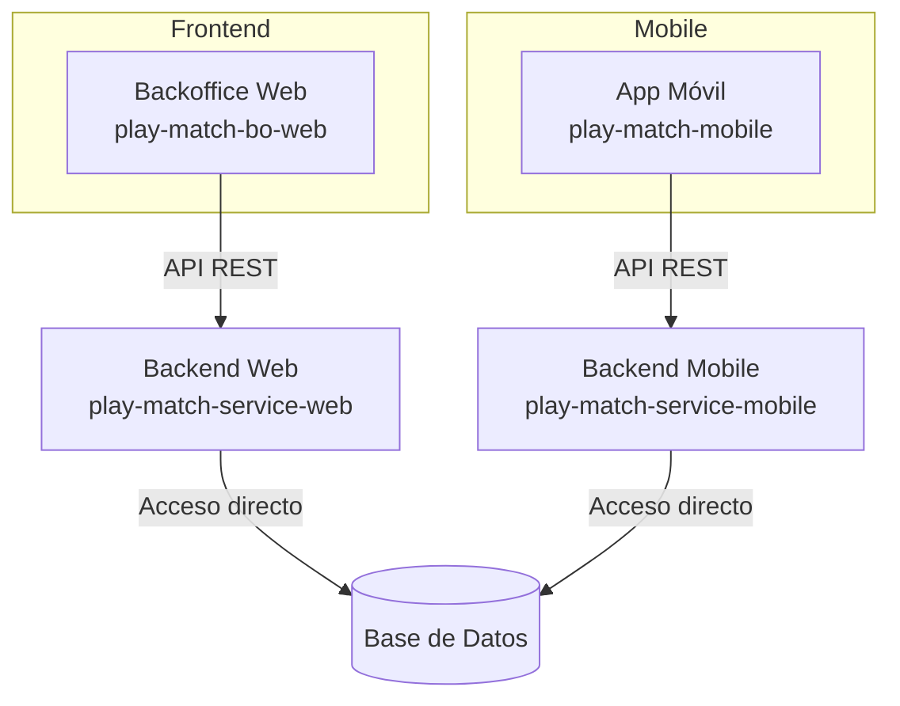

# Diagrama de Componentes

```mermaid
graph TD
    subgraph Frontend
        A[Backoffice Web<br>play-match-bo-web]
    end
    subgraph Mobile
        B[App Móvil<br>play-match-mobile]
    end
    C[Backend Web<br>play-match-service-web]
    E[Backend Mobile<br>play-match-service-mobile]
    D[(Base de Datos)]

    A -- "API REST" --> C
    B -- "API REST" --> E
    C -- "Acceso directo" --> D
    E -- "Acceso directo" --> D
```

Este diagrama muestra la arquitectura propuesta con dos backends independientes para el tráfico web y móvil, ambos accediendo a la misma base de datos.